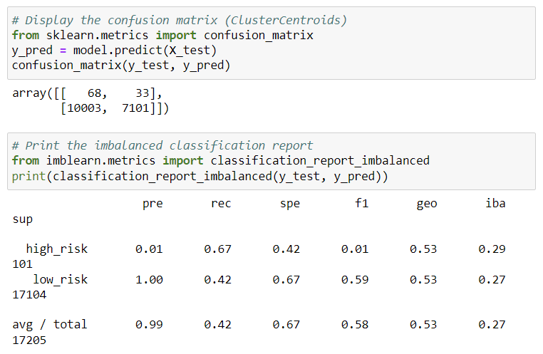

# Credit Risk Analysis

## Project Overview

Credit risk is an inherently unbalanced classification problem, as good loans easily outnumber risky loans. Therefore, you’ll need to employ different techniques to train and evaluate models with unbalanced classes. In this project I used imbalanced-learn and scikit-learn libraries to build and evaluate models using resampling.

Using the credit card credit dataset from LendingClub, a peer-to-peer lending services company, I oversampled the data using the RandomOverSampler and SMOTE algorithms, and undersample the data using the ClusterCentroids algorithm. Then, I used a combinatorial approach of over- and undersampling using the SMOTEENN algorithm. Next, I compared two new machine learning models that reduce bias, BalancedRandomForestClassifier and EasyEnsembleClassifier, to predict credit risk. Lastly, I evaluated the performance of these models.

# Results

## Random Over Sampler
* High Risk: Precision = 0.01 Recall = 0.69
* Low Risk: Precision = 1.00 Recall 0.56
* Average: Precision = 0.99 Recall = 0.59

## SMOTE algorithms
* High Risk: Precision = 0.01 Recall = 0.63
* Low Risk: Precision = 1.00 Recall 0.69
* Average: Precision = 0.99 Recall = 0.60

## Cluster Centroids algorithms
* High Risk: Precision = 0.01 Recall = 0.67
* Low Risk: Precision = 1.00 Recall 0.42
* Average: Precision = 0.99 Recall = 0.59

## Balanced Random Forest Classifier

* High Risk: Precision = 0.04 Recall = 0.67
* Low Risk: Precision = 1.00 Recall 0.91
* Average: Precision = 0.99 Recall = 0.91

## SMOTEENN algotithms
* High Risk: Precision = 0.01 Recall = 0.70
* Low Risk: Precision = 1.00 Recall 0.58
* Average: Precision = 0.99 Recall = 0.58

## Easy Ensemble Classifier
* High Risk: Precision = 0.09 Recall = 0.92
* Low Risk: Precision = 1.00 Recall 0.94
* Average: Precision = 0.99 Recall = 0.94

# Summary
* None of the modeles are perfect. They are correctly precision  